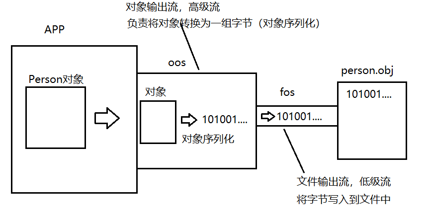

# day03

#### 文件流

### 块读写的文件复制操作

int read(byte[] data) 一次性从文件中读取给定的字节数组总长度的字节量，并存入到该数组中。 返回值为实际读取到的字节量。若返回值为-1则表示读取到了文件末尾。

块写操作 void write(byte[] data) 一次性将给定的字节数组所有字节写入到文件中

void write(byte[] data,int offset,int len) 一次性将给定的字节数组从下标offset处开始的连续len个字节写入文件

```java
package io;

import java.io.FileInputStream;
import java.io.FileOutputStream;
import java.io.IOException;

/**
 * 通过提高每次读写的数据，减少读写次数可以提高读写效率。
 */
public class CopyDemo2 {
  public static void main(String[] args) throws IOException {
    FileInputStream fis = new FileInputStream("01.rmvb");
    FileOutputStream fos = new FileOutputStream("01_cp.rmvb");
        /*
            块读:一次性读取一组字节
            块写:一次性将写出一组字节

            java.io.InputStream上定义了块读字节的方法:
            int read(byte[] data)
            一次性读取给定字节数组length个字节并从头开始装入到数组中。返回值为实际读取到的字节量
            如果返回值为-1则表示流读取到了末尾。
            文件流重写了该方法，作用是块读文件里的数据。

            java.io.OutputStream上定义了块写字节的方法:
            void write(byte[] data)
            一次性将给定的字节数组中所有的字节写出。

            void write(byte[] data,int offset,int len)
            一次性将给定的字节数组data中从下标offset处开始的连续len个字节写出。


            原文件数据(假设文件共6个字节):
            11110000 00001111 01010101 11111111 00000000 10101010

            byte[] buf = new byte[4];//创建一个长度为4的字节数组
            buf默认的样子(每个元素若以2进制表现):{00000000,00000000,00000000,00000000}
            int len;//记录每次实际读取的字节数

            当第一次调用:
            len = fis.read(buf);
            由于字节数组buf的长度为4.因此可以一次性最多从文件中读取4个字节并装入到buf数组中
            返回值len表示的整数是这次实际读取到了几个字节。

            原文件数据(假设文件共6个字节):
            11110000 00001111 01010101 11111111 00000000 10101010
            ^^^^^^^^ ^^^^^^^^ ^^^^^^^^ ^^^^^^^^
                     第一次读取的4个字节

            buf:{11110000，00001111，01010101，11111111}
            len:4 表示本次读取到了4个字节


            第二次调用:
            len = fis.read(buf);

            原文件数据(假设文件共6个字节):
            11110000 00001111 01010101 11111111 00000000 10101010 文件末尾了
                                                ^^^^^^^^ ^^^^^^^^ ^^^^^^^^ ^^^^^^^^
                                                本次实际只能读取到2个字节
            buf:{00000000，10101010，01010101，11111111}
                 |本次新读的2字节数据| |---上次的旧数据---|
            len:2表示本次实际只读取到了2个字节。它的意义就是告诉你buf数组中前几个字节是本次真实
                读取到的数据


            第三次调用:
            len = fis.read(buf);
            原文件数据(假设文件共6个字节):
            11110000 00001111 01010101 11111111 00000000 10101010 文件末尾了
                                                                  ^^^^^^^^ ^^^^^^^^ ^^^^^^^^ ^^^^^^^^
            buf:{00000000，10101010，01010101，11111111} 没有任何变化!
            len:-1 表示本次读取时已经是文件末尾了!!
         */
        /*
            00000000 8位2进制 1byte  1字节
            1024byte = 1kb
            1024kb = 1mb
            1024mb = 1gb
            1024gb = 1tb
         */
        /*
            编译完该句代码:byte[] buf = new byte[10240];

            在实际开发中，有时候用一个计算表达式更能表现这个值的含义时，我们不妨使用计算表达式
            long t = 864000000;
            long t = 60 * 60 * 24 * 1000;

         */
    byte[] buf = new byte[1024 * 10];//10kb
    int len;//记录每次实际读取到的字节数
    long start = System.currentTimeMillis();
    while ((len = fis.read(buf)) != -1) {
      fos.write(buf, 0, len);
    }
    long end = System.currentTimeMillis();
    System.out.println("复制完毕,耗时:" + (end - start) + "ms");
    fis.close();
    fos.close();
  }
}

```

### 写文本数据

String提供方法: byte[] getBytes(String charsetName) 将当前字符串转换为一组字节

参数为字符集的名字，常用的是UTF-8。 其中中文字3字节表示1个，英文1字节表示1个。

```java
package io;

import java.io.FileNotFoundException;
import java.io.FileOutputStream;
import java.io.IOException;
import java.nio.charset.StandardCharsets;

/**
 * 使用文件输出流向文件中写入文本数据
 */
public class WriteStringDemo {
    public static void main(String[] args) throws IOException {
        /*
            1:创建一个文件输出流
            2:将写出的文字先转换为2进制(一组字节)
            3:关闭流

            文件流有两种创建方式:
            1:覆盖模式，对应的构造器:
              FileOutputStream(String filename)
              FileOutputStream(File file)
              所谓覆盖模式:文件流在创建是若发现该文件已存在，则会将该文件原内容全部删除。然后
              在陆续将通过该流写出的内容保存到文件中。        
         */
        FileOutputStream fos = new FileOutputStream("fos.txt",true);
		String line = "让我再看你一遍，从南到北。";
        /*
            String提供了将内容转换为一组字节的方法:getBytes()
            java.nio.charset.StandardCharsets
         */
        byte[] data = line.getBytes(StandardCharsets.UTF_8);
        fos.write(data);

        line = "像是北五环路蒙住的双眼。";
        data = line.getBytes(StandardCharsets.UTF_8);
        fos.write(data);       

        System.out.println("写出完毕!");
        fos.close();
    }
}

```

### 文件输出流-追加模式

重载的构造方法可以将文件输出流创建为追加模式

- FileOutputStream(String path,boolean append)
- FileOutputStream(File file,boolean append)

当第二个参数传入true时，文件流为追加模式，即:指定的文件若存在，则原有数据保留，新写入的数据会被顺序的追加到文件中

```java
package io;

import java.io.FileNotFoundException;
import java.io.FileOutputStream;
import java.io.IOException;
import java.nio.charset.StandardCharsets;

/**
 * 使用文件输出流向文件中写入文本数据
 */
public class WriteStringDemo {
    public static void main(String[] args) throws IOException {
        /*
            1:创建一个文件输出流
            2:将写出的文字先转换为2进制(一组字节)
            3:关闭流

            文件流有两种创建方式:
            1:覆盖模式，对应的构造器:
              FileOutputStream(String filename)
              FileOutputStream(File file)
              所谓覆盖模式:文件流在创建是若发现该文件已存在，则会将该文件原内容全部删除。然后
              在陆续将通过该流写出的内容保存到文件中。

            2:追加模式，对应的构造器
              FileOutputStream(String filename,boolean append)
              FileOutputStream(File file,boolean append)
              当第二个参数为true时，那么就是追加模式。
              所谓追加模式:文件流在创建时若发现该文件已存在，则原内容都保留。通过当前流陆续写出
              的内容都会被陆续追加到文件末尾。
         */
        FileOutputStream fos = new FileOutputStream("fos.txt",true);

        String line = "斯国一!";
        byte[] data = line.getBytes(StandardCharsets.UTF_8);
        fos.write(data);

        line = "奥里给!";
        data = line.getBytes(StandardCharsets.UTF_8);
        fos.write(data);


        System.out.println("写出完毕!");
        fos.close();
    }
}

```

### 读取文本数据

```java
package io;

import java.io.FileInputStream;
import java.io.FileNotFoundException;
import java.io.IOException;
import java.nio.charset.StandardCharsets;

/**
 * 从文件中读取文本数据
 */
public class ReadStringDemo {
    public static void main(String[] args) throws IOException {
        /*
            1:创建一个文件输入流
            2:从文件中将字节都读取回来
            3:将读取到的字节转换回字符串
         */
        FileInputStream fis = new FileInputStream("fos.txt");

        byte[] data = new byte[1024];//1kb
        int len = fis.read(data);//块读操作，返回值表达实际读取到了多少字节
        System.out.println("实际读取了:"+len+"个字节");
        /*
            String提供了构造方法可以将一个字节数组还原为字符串
            String(byte[] data,Charset charset)
            将给定的字节数组data中所有字节按照给定的字符集转换为字符串。

            String(byte[] data,int offset,int len,Charset charset)
            将给定的字节数组data从下标offset处开始的连续len个字节按照指定的字符集转换为字符串
         */
        String line = new String(data,0,len,StandardCharsets.UTF_8);
        System.out.println(line.length());//输出字符串长度
        System.out.println(line);

        fis.close();
    }
}

```

#### 

### 高级流

#### 流连接示意图


#### 缓冲流

##### java.io.BufferedOutputStream和BufferedInputStream.

缓冲流是一对高级流,作用是提高读写数据的效率.

缓冲流内部有一个字节数组,默认长度是8K.缓冲流读写数据时一定是将数据的读写方式转换为块读写来保证读写效率.

##### 使用缓冲流完成文件复制操作


```java
package io;

import java.io.*;

/**
 * java将流分为节点流与处理流两类
 * 节点流:也称为低级流，是真实连接程序与另一端的"管道",负责实际读写数据的流。
 *       读写一定是建立在节点流的基础上进行的。
 *       节点流好比家里的"自来水管"。连接我们的家庭与自来水厂，负责搬运水。
 * 处理流:也称为高级流，不能独立存在，必须连接在其他流上，目的是当数据经过当前流时
 *       对其进行某种加工处理，简化我们对数据的同等操作。
 *       高级流好比家里常见的对水做加工的设备，比如"净水器"，"热水器"。
 *       有了它们我们就不必再自己对水进行加工了。
 * 实际开发中我们经常会串联一组高级流最终连接到低级流上，在读写操作时以流水线式的加工
 * 完成复杂IO操作。这个过程也称为"流的连接"。
 *
 * 缓冲流，是一对高级流，作用是加快读写效率。
 * java.io.BufferedInputStream和java.io.BufferedOutputStream
 *
 */
public class CopyDemo3 {
    public static void main(String[] args) throws IOException {
        FileInputStream fis = new FileInputStream("ppt.pptx");
        BufferedInputStream bis = new BufferedInputStream(fis);
        FileOutputStream fos = new FileOutputStream("ppt_cp.pptx");
        BufferedOutputStream bos = new BufferedOutputStream(fos);
        int d;
        long start = System.currentTimeMillis();
        while((d = bis.read())!=-1){//使用缓冲流读取字节
            bos.write(d);//使用缓冲流写出字节
        }
        long end = System.currentTimeMillis();
        System.out.println("耗时:"+(end-start)+"ms");
        bis.close();//关闭流时只需要关闭高级流即可，它会自动关闭它连接的流
        bos.close();
    }
}
```

##### 缓冲输出流写出数据时的缓冲区问题

通过缓冲流写出的数据会被临时存入缓冲流内部的字节数组,直到数组存满数据才会真实写出一次

```java
package io;

import java.io.BufferedOutputStream;
import java.io.FileNotFoundException;
import java.io.FileOutputStream;
import java.io.IOException;
import java.nio.charset.StandardCharsets;

/**
 * 缓冲输出流写出数据的缓冲区问题
 */
public class BOS_FlushDemo {
    public static void main(String[] args) throws IOException {
        FileOutputStream fos = new FileOutputStream("bos.txt");
        BufferedOutputStream bos = new BufferedOutputStream(fos);

        String line = "奥里给!";
        byte[] data = line.getBytes(StandardCharsets.UTF_8);
        bos.write(data);
        System.out.println("写出完毕!");
        /*
            缓冲流的flush方法用于强制将缓冲区中已经缓存的数据一次性写出。
            注:该方法实际上实在字节输出流的超类OutputStream上定义的，并非只有缓冲
            输出流有这个方法。但是实际上只有缓冲输出流的该方法有实际意义，其他的流实现
            该方法的目的仅仅是为了在流连接过程中传递flush动作给缓冲输出流。
         */
        bos.flush();//冲

        bos.close();

    }
}
```


### 高级流

#### 对象流

java.io.ObjectOutputStream和ObjectInputSteam

对象流是一对高级流，在流连接中的作用是进行对象的序列化与反序列化。

对象序列化:将一个java对象按照其结构转换为一组字节的过程

对象反序列化:将一组字节还原为java对象(前提是这组字节是一个对象序列化得到的字节)

##### 对象序列化的流连接操作原理图:



```java
package io;

import java.io.FileNotFoundException;
import java.io.FileOutputStream;
import java.io.IOException;
import java.io.ObjectOutputStream;

/**
 * 对象流(是一对高级流)
 * java.io.ObjectInputStream和ObjectOutputStream
 * 对象流在流连接中的作用是进行对象的序列化与反序列化
 * 其中对象输出流负责对象序列化。对象输入流负责对象反序列化
 *
 * 所谓对象序列化:
 * 将写出的对象按照其结构转换为一组字节的过程。
 */
public class OOSDemo {
    public static void main(String[] args) throws IOException {
        String name = "苍老师";
        int age = 55;
        String gender = "男";
        String[] otherInfo = {"摄影技术一流","喜欢拍片儿","是一名技术老师"};
        //将该Person对象写入文件person.obj中
        Person p = new Person(name,age,gender,otherInfo);

        FileOutputStream fos = new FileOutputStream("person.obj");
        ObjectOutputStream oos = new ObjectOutputStream(fos);
        /*
            对象输出流提供了一个直接写出对象的方法(进行对象序列化的操作)
            void writeObject(Object obj)

            序列化时可能出现异常：
            java.io.NotSerializableException: io.Person
            注:冒号后面的io.Person是指序列化的就是这个类的实例出现的错误
            原因:
            对象输出流在进行序列化对象时，要求该对象所属的类必须实现接口:java.io.Serializable接口
            并且该类中所有引用类型属性也必须实现该接口，否则会抛出上述异常。

         */
        oos.writeObject(p);
        System.out.println("写出完毕!");
        oos.close();


    }
}

```

##### 对象反序列化

```java
package io;

import java.io.FileInputStream;
import java.io.FileNotFoundException;
import java.io.IOException;
import java.io.ObjectInputStream;

/**
 * 使用对象输入流完成对象的反序列化
 */
public class OISDemo {
    public static void main(String[] args) throws IOException, ClassNotFoundException {
        //从person.obj文件中将对象反序列化回来
        FileInputStream fis = new FileInputStream("person.obj");
        ObjectInputStream ois = new ObjectInputStream(fis);
        /*
            Object readObject()
            该方法会进行对象的反序列化，如果对象流通过其连接的流读取的字节分析并非
            是一个java对象时，会抛出异常:ClassNotFoundException
         */
        Person p = (Person)ois.readObject();
        System.out.println(p);
    }
}
```

需要进行序列化的类必须实现接口:java.io.Serializable 实现序列化接口后最好主动定义序列化版本号这个常量。 这样一来对象序列化时就不会根据类的结构生成一个版本号,而是使用该固定值。 那么反序列化时，只要还原的对象和当前类的版本号一致就可以进行还原。

transient关键字可以修饰属性，用于在进行对象序列化时忽略不必要的属性，达到对象瘦身的目的

```java
package io;

import java.io.Serializable;
import java.util.Arrays;

/**
 * 使用当前类实例测试对象流的读写操作
 */
public class Person implements Serializable {
    public static final long serialVersionUID = 1L;
    private String name;//姓名
    private int age;//年龄
    private String gender;//性别
    private String[] otherInfo;//其他信息

    public Person(String name, int age, String gender, String[] otherInfo) {
        this.name = name;
        this.age = age;
        this.gender = gender;
        this.otherInfo = otherInfo;
    }

    public String getName() {
        return name;
    }

    public void setName(String name) {
        this.name = name;
    }

    public int getAge() {
        return age;
    }

    public void setAge(int age) {
        this.age = age;
    }

    public String getGender() {
        return gender;
    }

    public void setGender(String gender) {
        this.gender = gender;
    }

    public String[] getOtherInfo() {
        return otherInfo;
    }

    public void setOtherInfo(String[] otherInfo) {
        this.otherInfo = otherInfo;
    }

    @Override
    public String toString() {
        return "Person{" +
                "name='" + name + '\'' +
                ", age=" + age +
                ", gender='" + gender + '\'' +
                ", otherInfo=" + Arrays.toString(otherInfo) +
                '}';
    }
}
```


## 总结

##### java将流分为两类:节点流与处理流:

- **节点流**:也称为**低级流**.

  节点流的另一端是明确的,是实际读写数据的流,读写一定是建立在节点流基础上进行的.

- **处理流**:也称为**高级流**.

  处理流不能独立存在,必须连接在其他流上,目的是当数据流经当前流时对数据进行加工处理来简化我们对数据的该操作.

##### 实际应用中,我们可以通过串联一组高级流到某个低级流上以流水线式的加工处理对某设备的数据进行读写,这个过程也成为流的连接,这也是IO的精髓所在.

## 缓冲流

缓冲流是一对高级流，在流链接中链接它的**目的是加快读写效率**。缓冲流内部**默认缓冲区为8kb**，缓冲流**总是块读写数据来提高读写效率**。

#### java.io.BufferedOutputStream缓冲字节输出流，继承自java.io.OutputStream

##### 常用构造器

- BufferedOutputStream(OutputStream out)：创建一个默认8kb大小缓冲区的缓冲字节输出流，并连接到参数指定的字节输出流上。
- BufferedOutputStream(OutputStream out,int size)：创建一个size指定大小(单位是字节)缓冲区的缓冲字节输出流，并连接到参数指定的字节输出流上。

##### 常用方法

```
flush()：强制将缓冲区中已经缓存的数据一次性写出

缓冲流的写出方法功能与OutputStream上一致，需要知道的时write方法调用后并非实际写出，而是先将数据存入缓冲区(内部的字节数组中)，当缓冲区满了时会自动写出一次。
```

#### java.io.BufferedInputStream缓冲字节输出流，继承自java.io.InputStream

##### 常用构造器

- BufferedInputStream(InputStream in)：创建一个默认8kb大小缓冲区的缓冲字节输入流，并连接到参数指定的字节输入流上。
- BufferedInputStream(InputStream in,int size)：创建一个size指定大小(单位是字节)缓冲区的缓冲字节输入流，并连接到参数指定的字节输入流上。

##### 常用方法

```
缓冲流的读取方法功能与InputStream上一致，需要知道的时read方法调用后缓冲流会一次性读取缓冲区大小的字节数据并存入缓冲区，然后再根据我们调用read方法读取的字节数进行返回，直到缓冲区所有数据都已经通过read方法返回后会再次读取一组数据进缓冲区。即:块读取操作
```

### 对象流

对象流是一对高级流，在流链接中的作用是完成对象的**序列化**与**反序列化**

序列化：是对象输出流的工作，将一个对象按照其结构转换为一组字节的过程。

反序列化：是对象输入流的工作，将一组字节还原为对象的过程。

#### java.io.ObjectInputStream对象输入流，继承自java.io.InputStream

##### 常用构造器

ObjectInputStream(InputStream in)：创建一个对象输入流并连接到参数in这个输入流上。

##### 常用方法

Object readObject()：进行对象反序列化，将读取的字节转换为一个对象并以Object形式返回(多态)。

如果读取的字节表示的不是一个java对象会抛出异常:java.io.ClassNotFoundException

#### java.io.ObjectOutputStream对象输出流，继承自java.io.OutputStream

##### 常用构造器

ObjectOutputStream(OutputStream out)：创建一个对象输出流并连接到参数out这个输出流上

##### 常用方法

void writeObject(Object obj)：进行对象的序列化，将一个java对象序列化成一组字节后再通过连接的输出流将这组字节写出。

**如果序列化的对象没有实现可序列化接口:java.io.Serializable就会抛出异常:java.io.NotSerializableException**

#### 序列化接口java.io.Serrializable

该接口没有任何抽象方法，但是只有实现了该接口的类的实例才能进行序列化与反序列化。

实现了序列化接口的类建议显示的定义常量:static final long serialVersionUID = 1L;

可以为属性添加关键字**transient**，被该关键字修饰的属性在序列化是会被忽略，达到对象**序列化瘦身**的目的。


